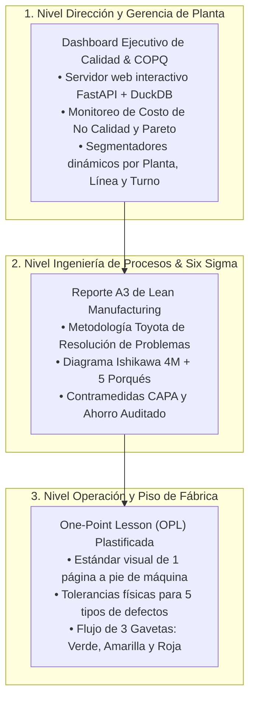

# 🎯 Decisiones de Calidad, Reducción de Scrap y Costo de Retrabajo (COPQ)
## Optimización de Decisiones Operativas en Piso mediante Lean Six Sigma DMAIC
**Proyecto 03 | Portafolio Técnico de Operaciones, Procesos y Calidad Industrial**  
**Autor:** Angelo Apolo | Ing. Químico / Industrial | Máster en Dirección de Proyectos y Empresas  
**Target Profesional:** Jefe / Ingeniero de Aseguramiento de Calidad (QA/QC), Ingeniero de Procesos / Six Sigma, Coordinador de Operaciones  

---

## 💡 El Dilema de Planta en 30 Segundos
En piso de producción, cuando un inspector detecta una pieza defectuosa se enfrenta al dilema diario:
* **¿Se envía a Scrap directo?** (Se asume la pérdida de material de inmediato, costo unitario ~$101.31 USD).
* **¿Se autoriza Retrabajo?** (Se invierte tiempo de operario y energía, pero si el defecto es severo, **más del 50% de las piezas fracasan** y terminan en la chatarra con un costo acumulado de **$126.78 USD**).

Este proyecto analiza **10,000 eventos reales de manufactura** para erradicar el retrabajo a ciegas y resolver el problema en los 3 niveles de la organización industrial: **Dirección (Dashboard Ejecutivo en Código Nativo & Power BI), Ingeniería (Reporte A3 Lean) y Piso de Planta (One-Point Lesson)**.

---

## 📊 Las 3 Cifras Clave del Proyecto
1. **$126.78 USD vs. $101.31 USD:**  
   Sobrecosto evitado por cada pieza severa que no se somete a reproceso inviable (**+$25.47 USD de ahorro neto por unidad**).
2. **+$4,878.44 USD en la muestra / +$48,648 USD al año:**  
   Ahorro financiero directo proyectado para una operación de 100,000 eventos anuales a Capex Cero.
3. **+78.0 Horas Hombre Devueltas:**  
   Capacidad de operarios y técnicos recuperada para producción útil al eliminar 191 retrabajos fallidos.

---

## 🖥️ Dashboard Ejecutivo de Operaciones (Código Puro)

El proyecto incluye un **tablero gerencial interactivo de alta fidelidad** desarrollado con **FastAPI + DuckDB In-Memory + Tailwind CSS + ApexCharts**, estructurado en 3 vistas ejecutivas idénticas a los estándares corporativos de planta:

1. **Página 1: Resumen Ejecutivo COPQ:**
   * 5 Tarjetas KPI principales: COPQ Total ($115.9K), Tasa de Scrap (2.48%), Tasa de Retrabajo (24.34%), Reclamos en Garantía (125) y Ahorro Anual Proyectado (+$48.6K).
   * Gráfico de columnas del costo medio por desenlace operativo (resaltando el costo crítico de $126.78 USD en rojo).
   * Gráfico de dona con la distribución de pérdidas COPQ (Falla Interna Retrabajo 71.8%, Falla Interna Scrap 23.8%, Falla Externa 4.4%).
2. **Página 2: Causa Raíz & Desempeño Operativo:**
   * Diagrama de Pareto 80/20 de defectos ordenado por costo y porcentaje acumulado.
   * Gráfico de barras de sobretasa de defectos por velocidad forzada (>139 u/h a 19.3%).
   * Gráfico de barras horizontales de degradación de calidad por antigüedad del activo (>8 años a 19.7%).
3. **Página 3: Eficacia de Inspección & Blindaje ante Cliente:**
   * Comparativa de tasa de escape a garantía por método de inspección (Manual 1.61% vs Sensores 0.93%).
   * Distribución de reclamos por grado de materia prima.
   * Tabla de auditoría de calidad con buscador en tiempo real y badges de severidad.

### 🚀 Cómo ejecutar el Dashboard en Local:
```bash
py -m pip install -r requirements.txt
py server.py
```
Abre en tu navegador: `http://localhost:8503`

---

## 🏭 Los 3 Pilares Profesionales del Proyecto



---

## 📁 Estructura del Repositorio

```text
03_Control_Calidad_Scrap_Retrabajo/
├── README.md                                         <-- Este resumen ejecutivo
├── PROJECT_TRACKER.md                               <-- Tablero y checklist de avance (100% completado)
├── EXPLICACION_PASO_A_PASO_PROYECTO.md              <-- Guía de defensa para entrevistas laborales (lectura de 10 min)
├── server.py                                        <-- Servidor FastAPI + DuckDB de alta velocidad (puerto 8503)
├── templates/
│   └── index.html                                   <-- Dashboard interactivo con Tailwind CSS + ApexCharts
├── Procfile & requirements.txt                      <-- Configuración de despliegue en la nube
├── data/
│   ├── manufacturing_quality_decisions_10000.csv    <-- Dataset oficial de 10,000 eventos de producción
│   ├── README_DATA.md                               <-- Ficha técnica y diccionario de variables
│   └── processed/
│       ├── powerbi_calidad_copq.csv                 <-- Dataset enriquecido con categorías COPQ y desenlaces
│       ├── resumen_kpis_calidad.json                <-- Resumen cuantitativo consolidado
│       ├── grafico_costo_desenlace.png              <-- Gráfico de costo unitario por desenlace
│       ├── grafico_severidad_retrabajo.png          <-- Gráfico de tasa de éxito vs scrap por severidad
│       └── grafico_causas_raiz.png                  <-- Gráfico de detonantes (velocidad, edad, material)
├── powerbi/
│   ├── GUIA_DISENO_VISUAL_DASHBOARD.md              <-- Paleta hex, tokens y diseño visual
│   ├── ESPECIFICACION_DASHBOARD_POWERBI.md          <-- Modelo estrella, medidas DAX y wireframes
│   └── capturas_dashboard/                          <-- Mockups de referencia de las 3 páginas
├── entregables_planta/
│   ├── Reporte_A3_Resolucion_Problemas_Calidad.md   <-- Reporte formal A3 bajo estándar Lean / Toyota
│   ├── OPL_Criterios_Calidad_Piso.md                <-- One-Point Lesson visual para pie de máquina
│   ├── Matriz_Decision_Retrabajo_Piso.xlsx          <-- Libro Excel con OPL imprimible y tablero COPQ
│   └── Ficha_Ejecutiva_STAR_Proyecto.md             <-- Resumen de 1 página para CV y LinkedIn
└── notebooks/
    └── 01_control_calidad_copq_y_decision.ipynb     <-- Notebook ejecutivo ejecutado con análisis estadístico
```

---

## 🛠️ Herramientas y Metodología Aplicada
* **Six Sigma DMAIC:** Define, Measure, Analyze, Improve, Control aplicado a 10,000 eventos industriales.
* **Lean Manufacturing:** Formato A3 de resolución de problemas y Lecciones de Un Punto (OPL) de gestión visual.
* **Full-Stack Analytics:** Backend FastAPI + DuckDB en memoria sirviendo APIs analíticas en milisegundos a un frontend en Tailwind CSS y ApexCharts.
* **Estadística Inferencial & Machine Learning:** Pruebas de hipótesis ANOVA/Chi2 y regresión logística multivariable para modelar $P(\text{Final Pass} = 1)$ con ROC-AUC = 0.81.
* **Cost of Poor Quality (COPQ):** Contabilidad de pérdidas por reprocesos fallidos, descartes de material y contingencias de garantía de clientes.

---

## 🤝 Autor & Contacto
* **Ing. Angelo Apolo**
* Ingeniero Químico / Industrial | Máster en Dirección de Proyectos y Empresas
* Especialista en Operaciones, Aseguramiento de Calidad (QA/QC) y Six Sigma