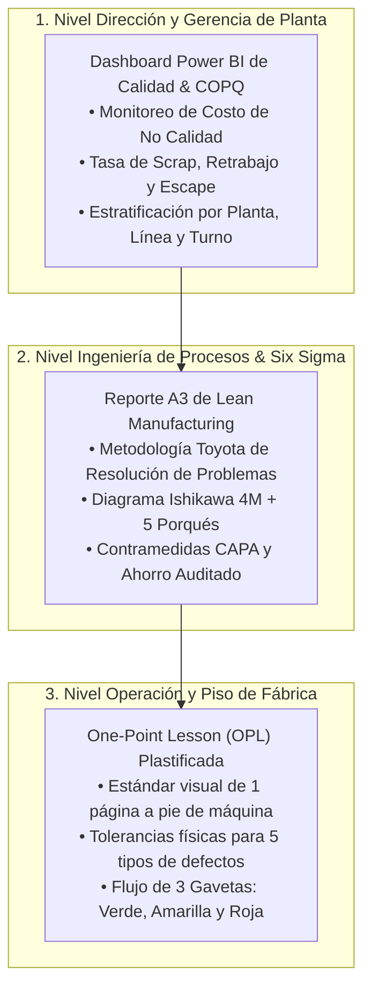

# 🎯 Decisiones de Calidad, Reducción de Scrap y Costo de Retrabajo (COPQ)
## Optimización de Decisiones Operativas en Piso mediante Lean Six Sigma DMAIC
**Proyecto 03 | Portafolio Técnico de Operaciones, Procesos y Calidad Industrial**  
**Autor:** Angelo Apolo | Ing. Químico / Industrial | Máster en Dirección de Proyectos y Empresas  
**Target Profesional:** Jefe / Ingeniero de Aseguramiento de Calidad (QA/QC), Ingeniero de Procesos / Six Sigma, Coordinador de Operaciones  

---

## 💡 El Dilema de Planta en 30 Segundos
En piso de producción, cuando un inspector detecta una pieza defectuosa se enfrenta al dilema diario:
* **¿Se envía a Scrap directo?** (Se asume la pérdida de material de inmediato, costo unitario ~$101.31 USD).
* **¿Se autoriza Retrabajo?** (Se invierte tiempo de operario y energía, pero si el defecto es severo, **más del 50% de las piezas fracasan** y terminan en la chatarra con un costo acumulado de **$126.78 USD**).

Este proyecto analiza **10,000 eventos reales de manufactura** para erradicar el retrabajo a ciegas y resolver el problema en los 3 niveles de la organización industrial: **Dirección (Power BI), Ingeniería (Reporte A3 Lean) y Piso de Planta (One-Point Lesson)**.

---

## 📊 Las 3 Cifras Clave del Proyecto
1. **$126.78 USD vs. $101.31 USD:**  
   Sobrecosto evitado por cada pieza severa que no se somete a reproceso inviable (**+$25.47 USD de ahorro neto por unidad**).
2. **+$4,863.79 USD en la muestra / +$48,648 USD al año:**  
   Ahorro financiero directo proyectado para una operación de 100,000 eventos anuales a Capex Cero.
3. **+78.0 Horas Hombre Devueltas:**  
   Capacidad de operarios y técnicos recuperada para producción útil al eliminar 191 retrabajos fallidos.

---

## 🏭 Los 3 Pilares Profesionales del Proyecto



---

## 📁 Estructura del Repositorio

```text
03_Control_Calidad_Scrap_Retrabajo/
├── README.md                                         <-- Este resumen ejecutivo
├── PROJECT_TRACKER.md                               <-- Tablero y checklist de avance (100% completado)
├── EXPLICACION_PASO_A_PASO_PROYECTO.md              <-- Guía de defensa para entrevistas laborales (lectura de 10 min)
├── requirements.txt                                  <-- Dependencias de análisis y ciencia de datos
├── data/
│   ├── manufacturing_quality_decisions_10000.csv    <-- Dataset oficial de 10,000 eventos de producción
│   ├── README_DATA.md                               <-- Ficha técnica y diccionario de variables
│   └── processed/
│       ├── powerbi_calidad_copq.csv                 <-- Dataset enriquecido con categorías COPQ y desenlaces
│       ├── resumen_kpis_calidad.json                <-- Resumen cuantitativo consolidado
│       ├── grafico_costo_desenlace.png              <-- Gráfico de costo unitario por desenlace
│       ├── grafico_severidad_retrabajo.png          <-- Gráfico de tasa de éxito vs scrap por severidad
│       └── grafico_causas_raiz.png                  <-- Gráfico de detonantes (velocidad, edad, material)
├── powerbi/
│   └── ESPECIFICACION_DASHBOARD_POWERBI.md          <-- Modelo estrella, medidas DAX y wireframes de 3 páginas
├── entregables_planta/
│   ├── Reporte_A3_Resolucion_Problemas_Calidad.md   <-- Reporte formal A3 bajo estándar Lean / Toyota
│   ├── OPL_Criterios_Calidad_Piso.md                <-- One-Point Lesson visual para pie de máquina
│   ├── Matriz_Decision_Retrabajo_Piso.xlsx          <-- Libro Excel con OPL imprimible y tablero COPQ
│   └── Ficha_Ejecutiva_STAR_Proyecto.md             <-- Resumen de 1 página para CV y LinkedIn
└── notebooks/
    └── 01_control_calidad_copq_y_decision.ipynb     <-- Notebook ejecutivo ejecutado con análisis estadístico
```

---

## 🛠️ Herramientas y Metodología Aplicada
* **Six Sigma DMAIC:** Define, Measure, Analyze, Improve, Control aplicado a 10,000 eventos industriales.
* **Lean Manufacturing:** Formato A3 de resolución de problemas y Lecciones de Un Punto (OPL) de gestión visual.
* **Estadística Inferencial & Machine Learning:** Pruebas de hipótesis ANOVA/Chi2 y regresión logística multivariable para modelar $P(\text{Final Pass} = 1)$ con ROC-AUC = 0.81.
* **Business Intelligence:** Modelo de datos en estrella y medidas DAX avanzadas en Power BI para control gerencial del Costo de No Calidad (COPQ).

---

## 🤝 Autor & Contacto
* **Ing. Angelo Apolo**
* Ingeniero Químico / Industrial | Máster en Dirección de Proyectos y Empresas
* Especialista en Operaciones, Aseguramiento de Calidad (QA/QC) y Six Sigma
