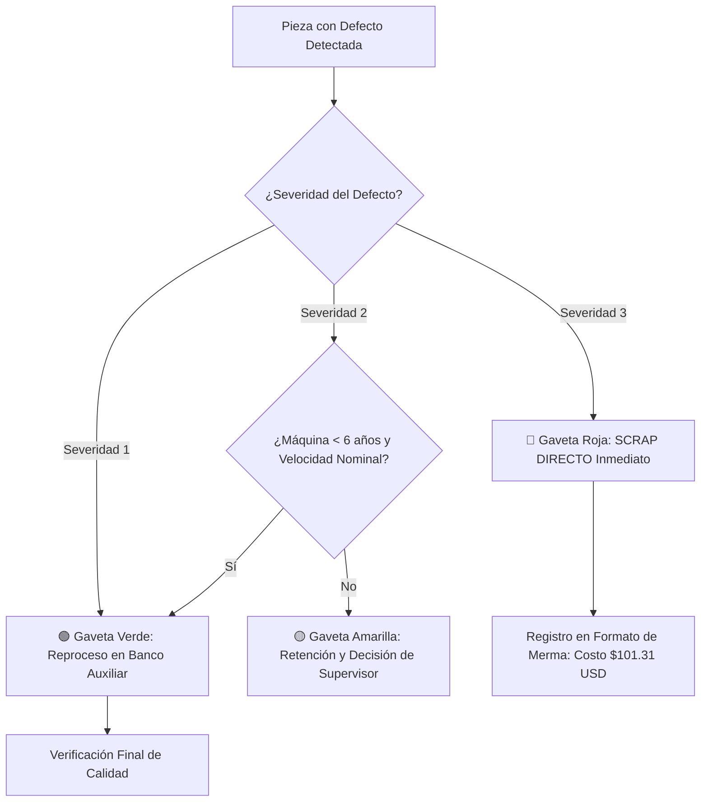

# 📑 LECCIÓN DE UN PUNTO (OPL - One-Point Lesson)
## Criterios Operativos de Decisión: Aceptación, Reproceso en Banco o Scrap Directo
**Código:** OPL-CAL-003 | **Revisión:** 02 | **Fecha de Vigencia:** Enero 2025  
**Aprobado por:** Ing. Angelo Apolo (Aseguramiento de Calidad / Black Belt)  
**Ubicación de Despliegue:** Puesto de Inspección en Línea (Pie de Máquina) | Líneas A & B  

---

### ⚠️ Regla de Oro de Planta (Lo que NUNCA se debe hacer)
> **PROHIBIDO RETRABAJAR PIEZAS CON SEVERIDAD 3 (GRIETAS O DEFORMACIONES GRAVES).**  
> En nuestra planta, **más del 50% de las piezas con defectos graves fracasan el reproceso** y terminan en chatarra de todas formas, generando un sobrecosto acumulado de **$126.78 USD** frente a los **$101.31 USD** del scrap directo.  
> **Retrabajar sin viabilidad es pagar la pieza dos veces y perder tiempo de operario.**

---

## 🚦 Matriz de Decisión Visual para el Inspector de Línea

| Tipo de Defecto | Severidad 1 (Leve) 🟢 GAVETA VERDE: REPROCESO | Severidad 2 (Moderada) 🟡 GAVETA AMARILLA: CUARENTENA | Severidad 3 (Crítica) 🔴 GAVETA ROJA: SCRAP DIRECTO |
|---|---|---|---|
| **Grieta / Fisura** (`crack`) | Microfisura capilar no pasante (< 2 mm). **Acción:** Sellado / alivio térmico en banco. *Éxito histórico: 82%* | Fisura longitudinal superficial (2 - 5 mm). **Acción:** **EVALUAR SUPERVISOR.** Solo con máquina <6 años. *Éxito histórico: 58%* | **Fisura pasante o ramificada (> 5 mm).** **Acción: SCRAP DIRECTO INMEDIATO.** Inutilizar la pieza para evitar mezcla. *Éxito: <38% | Fracaso seguro* |
| **Desviación Dimensional** (`dimension`) | Desvío menor respecto a plano ($\pm 0.05\text{ mm}$). **Acción:** Mecanizado ligero o ajuste de calibración. *Éxito histórico: 88%* | Desvío moderado ($\pm 0.10\text{ a } 0.25\text{ mm}$). **Acción:** Reperfilado en banco auxiliar previa autorización. *Éxito histórico: 76%* | **Desvío crítico (> 0.30 mm) o falta de material.** **Acción: SCRAP DIRECTO.** Imposible recuperar tolerancia sin debilitar pared. *Fracaso: >52%* |
| **Acabado Superficial** (`finish`) | Rugosidad leve, rebaba menor o marca de mordaza. **Acción:** Desbarbado manual y pulido rápido (< 5 min). *Éxito histórico: 87%* | Manchas de enfriamiento o textura irregular. **Acción:** **EVALUAR SUPERVISOR.** Autorizado si no afecta cara de cliente. *Éxito histórico: 72%* | **Porosidad abierta, quemadura térmica o desgarre.** **Acción: SCRAP DIRECTO.** Defecto penetra más del 20% del espesor. *Fracaso: >52%* |
| **Rayón / Abrasión** (`scratch`) | Rayón superficial que no traba la uña (< 0.05 mm). **Acción:** Pulido abrasivo fino. *Éxito histórico: 85%* | Rayón visible que traba la uña (0.05 - 0.15 mm). **Acción:** **EVALUAR SUPERVISOR.** Verificar si es zona de sello. *Éxito histórico: 62%* | **Surco profundo (> 0.20 mm) o daño en plano de junta.** **Acción: SCRAP DIRECTO.** Compromete estanqueidad y garantía a 90 días. *Fracaso: >58%* |
| **Contaminación** (`contamination`) | Polvo o partículas ambientales secas en superficie. **Acción:** Soplado neumático y limpieza con solvente. *Éxito histórico: 86%* | Partículas adheridas o manchas leves de lubricante. **Acción:** Lavado ultrasónico / desengrase controlado. *Éxito histórico: 65%* | **Inclusiones fundidas o incrustación de viruta metálica.** **Acción: SCRAP DIRECTO.** Riesgo crítico de falla en manos del cliente. *Fracaso: >55%* |

---

## 📋 Flujo de Trabajo en Estación de Calidad (3 Pasos)

1. **Paso 1 (Identificación):** Compara el defecto con las muestras patrón de la estación y determina la severidad (1, 2 o 3).
2. **Paso 2 (Destino Físico Inmediato):**
   * **Severidad 1:** Deposita en la **Gaveta Verde**. Tiempo máximo permitido de reproceso: 15 minutos.
   * **Severidad 2:** Deposita en la **Gaveta Amarilla**. Requiere firma de liberación del Supervisor de Turno.
   * **Severidad 3:** Deposita en la **Gaveta Roja** para disposición de Scrap. Marca la pieza con pintura roja indeleble.
3. **Paso 3 (Registro):** Ingresa la clasificación en el parte de producción diario para alimentar el cuadro de mando de calidad (Power BI).

---

### 🛡️ Compromiso del Inspector
* *"Mi trabajo no es ocultar el scrap, sino evitar que la empresa gaste dinero en piezas que no tienen salvación."*
* *"Toda pieza en Gaveta Roja ahorra **$25.47 USD** de sobrecosto por retrabajo inútil."*
